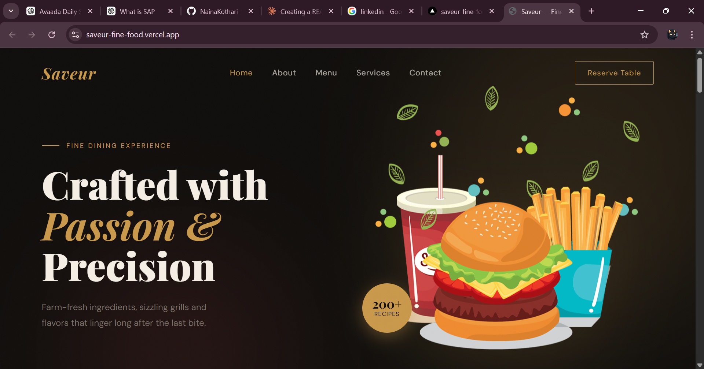
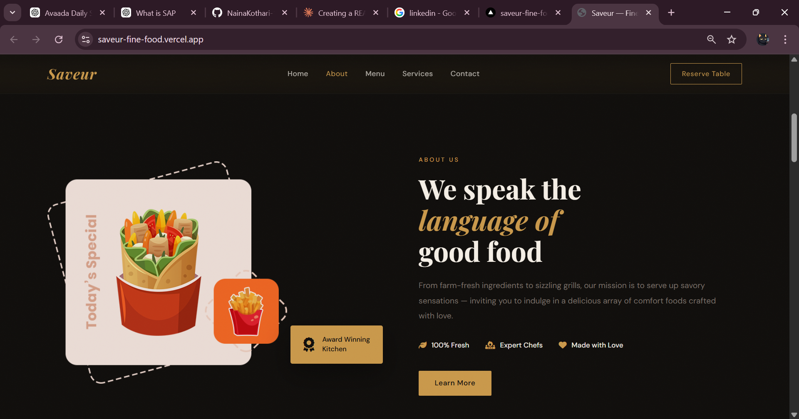
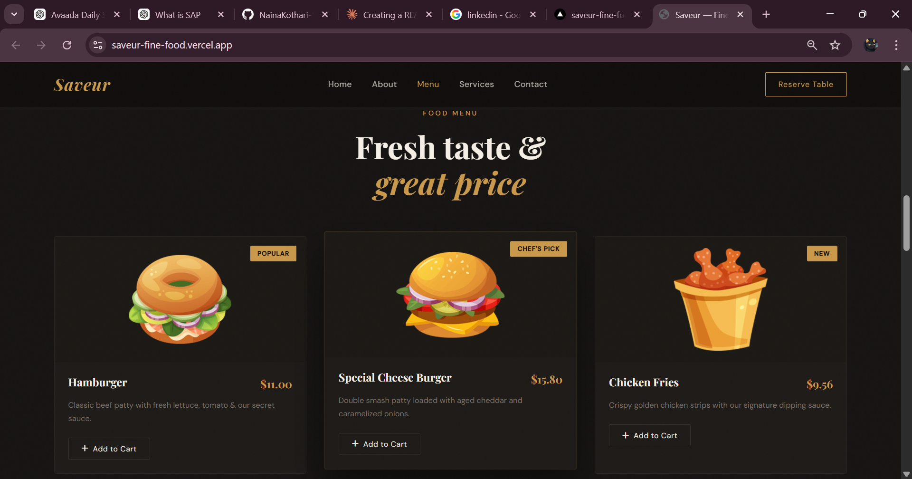
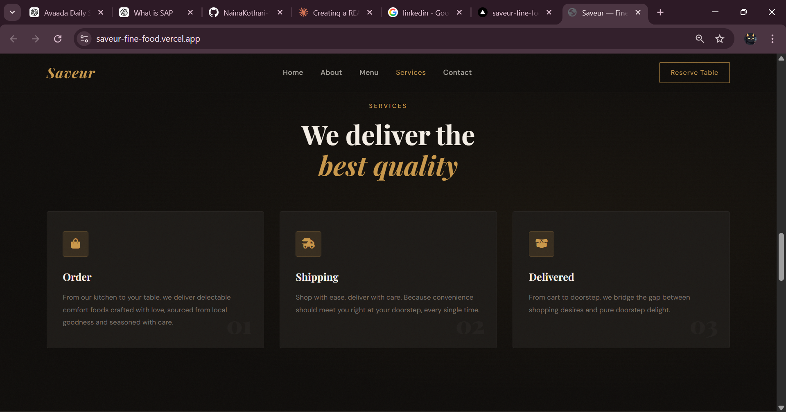
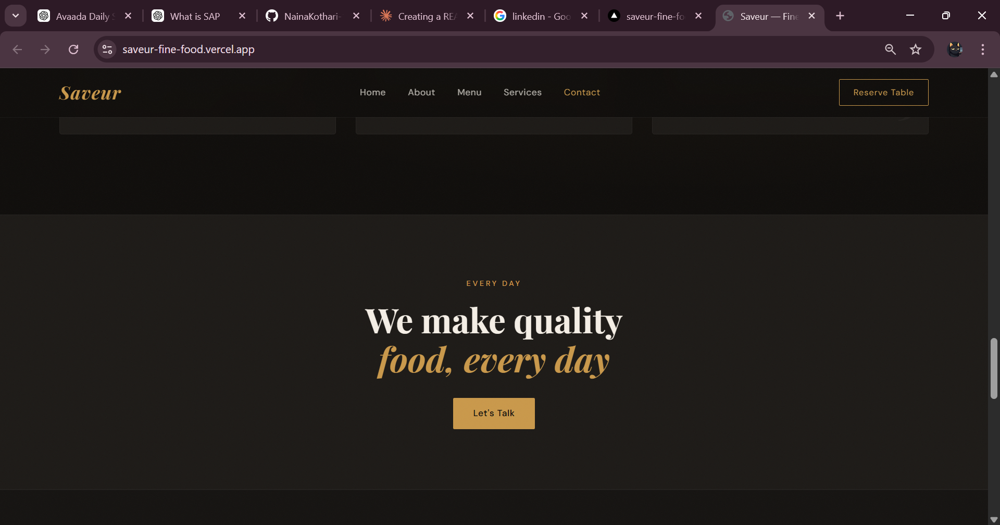
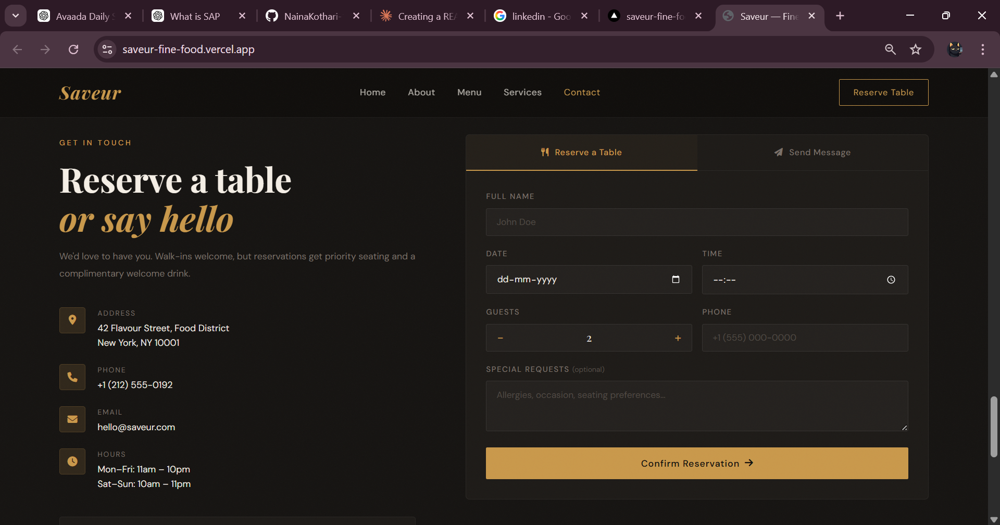

# 🍽️ Saveur — Fine Food

A modern, fully responsive fine dining restaurant website built with HTML, CSS, and JavaScript — featuring smooth animations, a food menu, table reservations, and a contact form.

[](https://saveur-fine-food.vercel.app/)


---

## 📸 Screenshots

| | |
|:---:|:---:|
|  |  |
| *Home* | *About* |
|  |  |
| *Menu* | *Services* |
|  |  |
| *Contact* | *Contact Form* |

---

## ✨ Features

- 🎬 Scroll reveal animations with staggered entrance effects
- 🍔 Food menu cards with **Add to Cart** toast notifications
- 📅 Table reservation form with guest counter and form validation
- 📩 Contact/message form with success & error feedback
- 🔗 Active nav link highlighting on scroll
- 📜 Infinite scrolling marquee of menu items
- 📱 Fully responsive with a hamburger menu for mobile
- 🔝 Sticky header that styles on scroll

---

## 🛠️ Built With

| Technology | Usage |
|------------|-------|
| HTML5 | Structure & layout |
| CSS3 | Styling, animations & glassmorphism |
| JavaScript (Vanilla) | Interactivity, scroll effects & form logic |
| [Font Awesome 6](https://fontawesome.com/) | Icons |
| [Google Fonts](https://fonts.google.com/) | Playfair Display & DM Sans |

---

## 📂 Project Structure

```
Saveur-Fine-Food/
├── index.html            # Main HTML file
├── asset/
│   ├── style.css         # All styles & animations
│   ├── script.js         # JS logic
│   └── image/
│       ├── home.png      # Hero dish image
│       ├── about.png     # About section image
│       ├── food1.png     # Hamburger
│       ├── food2.png     # Special Cheese Burger
│       └── food3.png     # Chicken Fries
└── screenshots/
    ├── Home.png
    ├── About.png
    ├── Menu.png
    ├── Services.png
    ├── Contact.png
    └── Contact-form.png
```

---

## 📑 Sections

| Section | Description |
|---------|-------------|
| **Home** | Hero with stats badge, CTA buttons and scroll hint |
| **Marquee** | Infinite scrolling strip of menu highlights |
| **About** | Story, features (Fresh · Expert Chefs · Made with Love) |
| **Menu** | 3 food cards with prices, tags and Add to Cart toasts |
| **Services** | Order → Shipping → Delivered pipeline cards |
| **Contact** | Tabbed form — reserve a table or send a message |

---

## ⚙️ Getting Started

1. **Clone the repository**
   ```bash
   git clone https://github.com/NainaKothari-14/Saveur-Fine-Food.git
   ```

2. **Navigate into the project folder**
   ```bash
   cd Saveur-Fine-Food
   ```

3. **Open `index.html` in your browser**  
   Just double-click — no build step or dependencies needed!

---

## 👩‍💻 Author

**Naina Kothari**  
GitHub: [@NainaKothari-14](https://github.com/NainaKothari-14)
